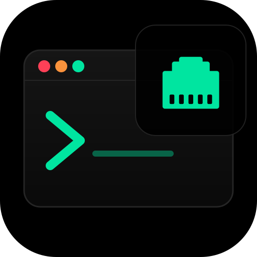
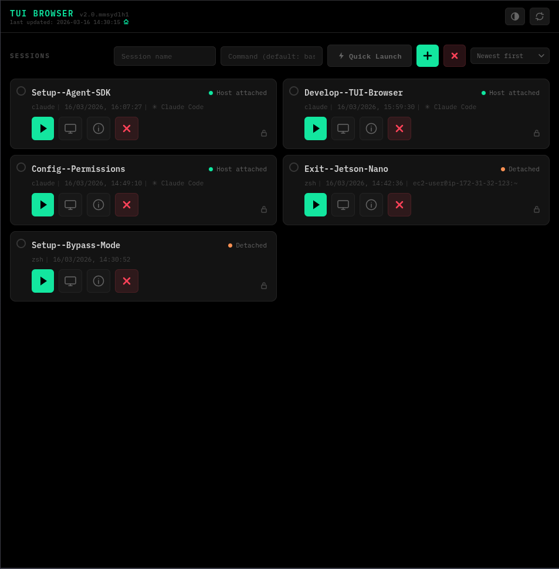
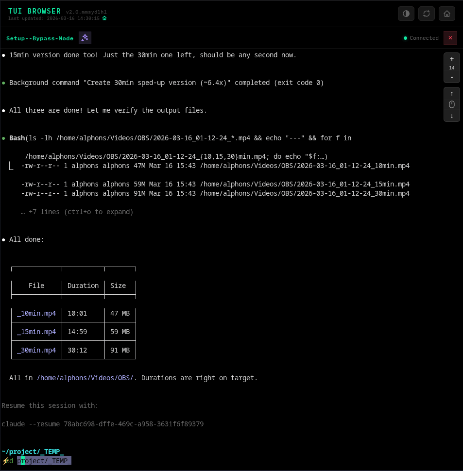
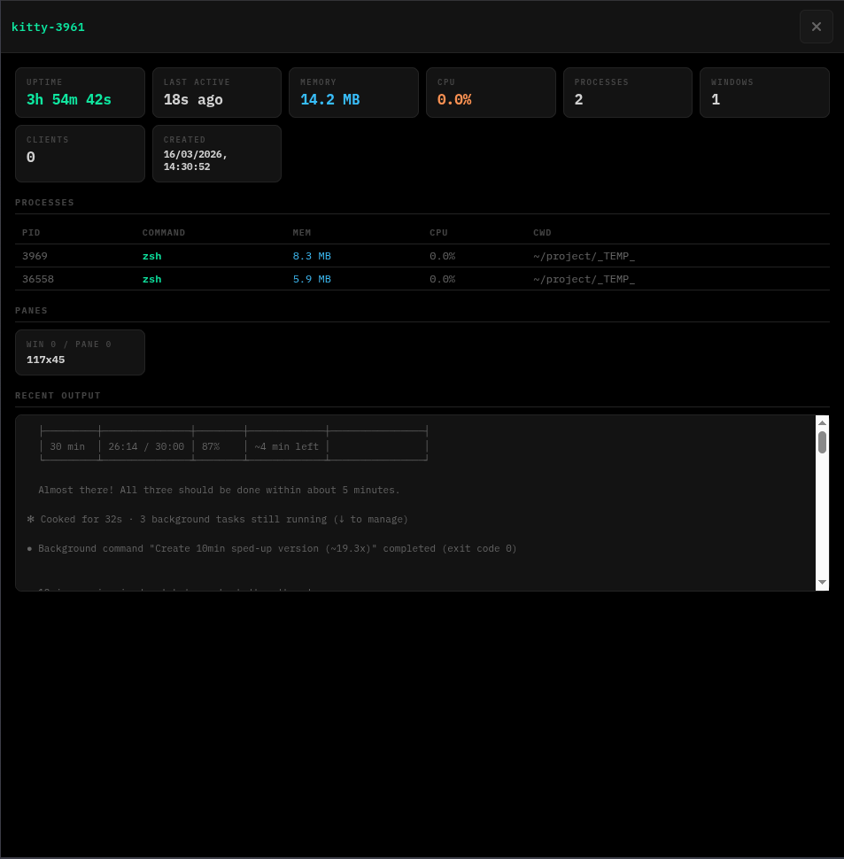

<p align="center">
  
</p>

<h1 align="center">TUI Browser</h1>

<p align="center">
  <strong>VNC for terminals</strong> — not another SSH web client.<br>
  Mirrors your actual desktop terminal to any browser in real-time.
</p>

<p align="center">
  <a href="#quick-start">Quick Start</a> &middot;
  <a href="#features">Features</a> &middot;
  <a href="#why-not-just-ssh">Why Not SSH?</a> &middot;
  <a href="#api">API</a>
</p>

---

Access and control your terminal sessions from any browser — phone, tablet, or another computer. The browser and host terminal stay perfectly in sync, both viewing and controlling the same tmux session. Unlike SSH tools that spawn isolated shells, this mirrors your actual desktop terminal in real-time.

Built for TUI-heavy workflows (Claude Code, OpenCode, Codex, htop, etc.) where you want to start something on your desktop and check on it from your phone.

<p align="center">
  
  <br><sub>Session dashboard — AI-generated titles, status indicators, quick actions</sub>
</p>

## Features

- **VNC-style mirroring** — browser and Kitty terminal show the exact same content. Type in either, both update.
- **Unified dashboard** — tmux sessions enriched with Kitty metadata (tab title, focus state, viewer count)
- **Auto-discovery** — PID matching links Kitty windows to their tmux sessions automatically
- **Session management** — create, connect, kill, rename sessions from the browser. New sessions also open a Kitty window on the host.
- **Bulk session kill** — select multiple sessions to kill at once, or use filter presets: detached, idle, no running commands, or all
- **Session info panel** — live-updating stats: memory, CPU, process tree, uptime, recent terminal output
- **AI session titles** — uses Claude CLI (haiku) to auto-generate contextual session names from terminal output
- **Quick Launch** — preset and custom commands saved to `shortcuts.json`, launch sessions in one tap
- **Session sorting** — sort by newest, oldest, recently active, or least active
- **Open on PC** — relaunch dangling sessions into a Kitty window from the dashboard
- **Multi-client** — multiple browsers can connect to the same session
- **60fps TUI support** — tmux + xterm.js WebGL handles high-frequency rendering (Claude Code, Ratatui apps, etc.)
- **Mobile-optimized** — quick-keys bar, scroll controls, text selection overlay, keyboard-aware viewport
- **PWA with auto-update** — installable app, polls server version, auto-reloads on code changes
- **Online/offline detection** — toast notifications for connectivity changes
- **Cache-first rendering** — sessions load instantly from cache, no flash on page load or phone wake
- **Auto-restart** — systemd service with file watcher restarts the server on code changes
- **Cloudflare Tunnel** — secure remote access via HTTPS with zero port forwarding
- **Zero build frontend** — vanilla JS, xterm.js from CDN, no bundler

<table>
  <tr>
    <td align="center">
      
      <br><sub>Terminal view — xterm.js with WebGL, quick-keys, scroll controls</sub>
    </td>
    <td align="center">
      
      <br><sub>Session info — live memory, CPU, process tree, recent output</sub>
    </td>
  </tr>
</table>

## Quick Start

```bash
# One-command setup: installs deps, configures tmux, sets up systemd service
./install.sh
```

The install script handles:
- npm dependencies
- `~/.local/bin/tmux-kitty-shell` wrapper (launches Kitty windows inside tmux)
- `~/.tmux.conf` (terminal capabilities, UTF-8, passthrough for TUI apps)
- systemd user service (auto-start on boot, even before login)
- systemd file watcher (auto-restart on code changes)

After install, the dashboard is at `http://localhost:7483`.

### Manual Start (without systemd)

```bash
npm install
PORT=7483 npm start
```

### Prerequisites

- **Node.js** >= 18
- **tmux** >= 3.2 (for `allow-passthrough`)
- **Kitty** (optional — for host terminal integration)
- **Claude CLI** (optional — for AI session title generation)

### Kitty Setup (optional)

Add to `~/.config/kitty/kitty.conf`:

```
allow_remote_control yes
listen_on unix:/tmp/kitty-socket
shell /path/to/your/.local/bin/tmux-kitty-shell
```

Restart Kitty. Every new window will launch inside tmux, and the dashboard will show them with Kitty badges.

## Local Network Fast-Path (Auto-Switching)

When your phone/tablet is on the same network as the host PC (WiFi, hotspot), the app automatically switches from the Cloudflare tunnel to a direct local connection for dramatically lower latency.

**How it works:**
- The server runs HTTPS on port 7484 alongside HTTP on 7483
- The client races local IPs against the tunnel on every network event — fastest path wins
- When a local connection succeeds, the WebSocket switches to the direct path instantly
- When the local connection is lost, it falls back to the tunnel seamlessly
- A green house icon in the header = local (LAN), orange globe = tunnel (internet)

**Detection triggers** — the app re-checks the best path on:
- Dashboard session polling (every 3 seconds, piggybacks on existing calls)
- Network type changes (WiFi ↔ mobile data)
- Online/offline transitions
- Phone wake / tab focus
- WebSocket disconnection (strongest signal of network change)

**One-time setup per device:**

1. Generate certificates (done automatically by `install.sh`, or manually):
   ```bash
   ./scripts/generate-certs.sh
   ```

2. Accept the certificate on your device. A guided setup page is available at `/setup-local.html`:

   **Android (Chrome):**
   - Open the setup page — tap the link to your local server
   - Tap **Advanced** → **Proceed to [IP] (unsafe)** (this is safe — it's your own server)
   - Chrome remembers the exception permanently

   **iOS (Safari):**
   - Download the CA cert from the setup page
   - Go to **Settings > General > VPN & Device Management** → Install the profile
   - Go to **Settings > General > About > Certificate Trust Settings** → Enable trust

   **Desktop:**
   - Visit `https://localhost:7484` and accept the warning
   - Or run `sudo mkcert -install` to trust system-wide

3. The app will detect the local connection within seconds and switch — green house icon appears

**When does it activate?**
- Phone connected to same WiFi as the host PC
- Phone hotspot with the PC connected to it
- Any network where both devices can reach each other directly

**Regenerating certificates** (e.g., when your local IP changes):
```bash
./scripts/generate-certs.sh
systemctl --user restart tui-browser
```
You'll need to re-accept the cert on your devices after regenerating.

## Remote Access (Cloudflare Tunnel)

For secure access from anywhere (phone, other computers), use a [Cloudflare Tunnel](https://developers.cloudflare.com/cloudflare-one/connections/connect-networks/):

```bash
# Create tunnel
cloudflared tunnel create tui-browser

# Route your domain
cloudflared tunnel route dns tui-browser tui.yourdomain.com

# Create config (~/.cloudflared/tui-browser.yml)
tunnel: <TUNNEL_ID>
credentials-file: /path/to/.cloudflared/<TUNNEL_ID>.json

ingress:
  - hostname: tui.yourdomain.com
    service: http://localhost:7483
  - service: http_status:404
```

Then create a systemd user service to keep the tunnel running:

```ini
# ~/.config/systemd/user/tui-browser-tunnel.service
[Unit]
Description=Cloudflare Tunnel for TUI Browser
After=network-online.target tui-browser.service
Wants=network-online.target

[Service]
Type=simple
ExecStart=/usr/bin/cloudflared tunnel --config /path/to/.cloudflared/tui-browser.yml run
Restart=on-failure
RestartSec=5

[Install]
WantedBy=default.target
```

```bash
systemctl --user enable --now tui-browser-tunnel.service
```

## Security

**This tool gives full shell access from a browser. Do not expose without authentication.**

### Recommended: Cloudflare Access (Zero Trust)

If using Cloudflare Tunnel, add [Cloudflare Access](https://developers.cloudflare.com/cloudflare-one/applications/configure-apps/self-hosted-apps/) for authentication:

1. Go to **Cloudflare One** → **Access** → **Applications**
2. Add a **Self-hosted** application with your tunnel domain
3. Create an **Allow** policy with your email
4. Cloudflare shows a login page and sends a one-time code to verify identity

This is the recommended approach — authentication is handled by Cloudflare's infrastructure before traffic ever reaches your server. No passwords to manage, no custom auth code to maintain.

### Alternatives

- **Reverse proxy with auth** — nginx/Caddy with TLS + basic auth or OAuth
- **Localhost only** — bind to 127.0.0.1 and use SSH tunneling (`ssh -L 7483:localhost:7483 user@host`)
- **Firewall** — block port 7483 from external access

## Service Management

```bash
# TUI Browser server
systemctl --user start tui-browser
systemctl --user stop tui-browser
systemctl --user restart tui-browser
systemctl --user status tui-browser
journalctl --user -u tui-browser -f    # tail logs

# Cloudflare tunnel (if configured)
systemctl --user start tui-browser-tunnel
systemctl --user stop tui-browser-tunnel
```

## API

### REST

| Method | Endpoint | Description |
|--------|----------|-------------|
| `GET` | `/api/discover` | Unified discovery (tmux sessions + Kitty windows) |
| `GET` | `/api/version` | Server version + build ID + claude availability |
| `GET` | `/api/network` | Local IPs + HTTPS port for LAN fast-path |
| `GET` | `/api/health` | Server + tmux + Kitty status |
| `GET` | `/api/sessions` | List tmux sessions |
| `GET` | `/api/sessions/:name` | Session details + preview |
| `GET` | `/api/sessions/:name/info` | Live session stats (memory, CPU, processes, output) |
| `GET` | `/api/kitty/windows` | Kitty window discovery (debug, prefer `/api/discover`) |
| `POST` | `/api/sessions` | Create session `{ name, command, cwd }` |
| `POST` | `/api/sessions/bulk-kill` | Bulk kill `{ names[], filter?, inactiveMinutes? }` |
| `POST` | `/api/sessions/:name/rename` | Rename `{ newName }` |
| `POST` | `/api/sessions/:name/open-terminal` | Open Kitty window for session |
| `POST` | `/api/sessions/:name/generate-title` | AI-generate session title via Claude CLI |
| `POST` | `/api/shortcuts` | Add custom shortcut `{ label, command }` |
| `DELETE` | `/api/sessions/:name` | Kill session |

### WebSocket

Connect to `/ws/terminal/:sessionName`:

```js
// Client → Server
{ "type": "attach", "cols": 80, "rows": 24 }
{ "type": "input", "data": "ls\r" }
{ "type": "resize", "cols": 120, "rows": 40 }

// Server → Client
// Raw terminal output (ANSI preserved) or:
{ "type": "session-ended", "sessionName": "..." }
```

## Project Structure

```
tui-browser/
├── server/
│   ├── index.js              # HTTP/HTTPS + WebSocket server orchestrator
│   ├── routes.js             # All REST API route handlers
│   ├── state.js              # Persistent state (display titles, locks)
│   ├── ai-titles.js          # AI title generation via Claude CLI
│   ├── session-manager.js    # PTY lifecycle, multi-client, Kitty launch
│   ├── discovery.js          # tmux + unified discovery with PID matching
│   ├── kitty-discovery.js    # Kitty remote control discovery
│   └── exec-util.js          # Shared subprocess utility
├── public/
│   ├── index.html            # SPA shell
│   ├── js/
│   │   ├── app.js            # Hash router, modal, toast, version polling
│   │   ├── app-network.js    # Local network fast-path detection
│   │   ├── dashboard.js      # Session cards, rendering, CRUD
│   │   ├── dashboard-shortcuts.js  # Quick Launch dropdown
│   │   ├── dashboard-bulk-kill.js  # Selection + bulk kill modal
│   │   ├── dashboard-info.js       # Session info overlay
│   │   ├── terminal.js       # xterm.js setup + WebSocket connection
│   │   └── terminal-controls.js    # Scroll, text select, session ops
│   └── css/
│       ├── base.css           # Theme variables, header, buttons, modal
│       ├── dashboard.css      # Session cards, toolbar, shortcuts
│       ├── terminal.css       # Terminal view, quick-keys, scroll controls
│       └── info-panel.css     # Session info overlay + stats
├── scripts/
│   └── tmux-kitty-shell      # Wrapper: launches Kitty windows inside tmux
├── install.sh                # One-command setup
└── package.json
```

## Mobile Controls

The terminal view includes touch-optimized controls:

- **Quick-keys bar** — Esc, Tab, Ctrl+C/D/Z, arrow keys, and a Sel (text select) button
- **Scroll controls** — floating up/down buttons (top-right) to scroll tmux history via copy-mode
- **Text selection** — tap Sel to open terminal output in a native-selectable overlay with Copy All
- **Keyboard awareness** — UI shifts above the soft keyboard automatically
- **Double-tap** a session card on the dashboard to connect directly

## Kitty + tmux Gotchas

Running Kitty windows inside tmux breaks a few things (tab CWD, titles, Shift+Enter). See [docs/kitty-tmux-integration.md](docs/kitty-tmux-integration.md) for fixes.

## tmux Tips

- **Scroll up**: mouse wheel scrolls the buffer when `mouse on` is set in `~/.tmux.conf` (the install script enables this).
- **Select text**: hold `Shift` while clicking/dragging to use your terminal's native selection — this bypasses tmux's copy mode, which otherwise jumps to the bottom after selecting.
- **Copy-mode (keyboard)**: `Ctrl+b` then `[` enters copy mode. Use arrow keys / `Page Up` / `Page Down` to scroll. Press `q` to exit.

## AI Session Titles

If the [Claude CLI](https://claude.com/claude-code) is installed, sessions can be auto-titled based on their terminal content:

- **Automatic**: new sessions get a title once they cross 15 lines of output (one-time, uses haiku model)
- **Manual**: click the sparkle icon next to the session name in terminal view to regenerate
- **Smart context**: extracts first 150 + last 150 lines of the last command's output (skips the middle for long outputs)
- **Human-safe**: manually renamed sessions are never auto-overwritten

## How It Works

```
Phone/Tablet/Laptop Browser              Host Machine (Kitty + tmux)
┌──────────────────────────┐            ┌────────────────────────────────────┐
│  Dashboard               │            │  Node.js Server (port 7483)       │
│  ┌─────────────────────┐ │   HTTPS    │  ├── REST API (session CRUD)      │
│  │ Unified session     │ │◄══════════►│  ├── WebSocket (terminal I/O)     │
│  │ cards with Kitty    │ │  Cloudflare│  ├── tmux discovery               │
│  │ badges              │ │   Tunnel   │  ├── Kitty discovery + PID match  │
│  └─────────────────────┘ │            │  └── session-manager (node-pty)   │
│  Terminal View           │            │       └── tmux attach             │
│  ┌─────────────────────┐ │            └────────────────────────────────────┘
│  │ xterm.js (WebGL)    │ │                       │
│  │ Full bidirectional  │ │                       ▼
│  │ terminal I/O        │ │            ┌────────────────────┐
│  └─────────────────────┘ │            │ tmux session       │
└──────────────────────────┘            │ (shared by Kitty   │
                                        │  + browser)        │
                                        └────────────────────┘
```

1. **Every Kitty window runs inside tmux** via a wrapper script (`tmux-kitty-shell`)
2. **PID matching** links Kitty windows to tmux sessions (`kitty_window.pid == tmux_client.client_pid`)
3. **Browser connects** to the same tmux session via node-pty + WebSocket
4. **Both viewers** (Kitty + browser) see identical output — tmux handles multi-client sync natively
5. **Creating a session** from the browser also opens a Kitty window on the host
6. **Killing a session** from the browser closes the Kitty window automatically

---

## Why Not Just SSH?

SSH-based web terminals (WeTTY, shellinabox) and terminal sharing tools solve a different problem. They give you a *new* shell session in your browser. TUI Browser gives you your *existing* session — the one already running on your desktop.

**The core difference is mirroring vs. remoting:**

| | SSH web clients | TUI Browser |
|---|---|---|
| **What you see** | A new, separate shell | Your actual desktop terminal |
| **Session relationship** | Independent — browser and desktop are different sessions | Shared — browser and desktop are the same session |
| **Start a build on desktop, check from phone** | Can't — phone has its own shell | Yes — phone sees exactly what your desktop shows |
| **Multiple viewers** | Each gets their own session | All see the same output, type into the same session |
| **Session persistence** | Dies when browser tab closes | tmux session persists forever — reconnect anytime |
| **TUI rendering (60fps)** | Varies — often broken through SSH layers | Native — raw PTY via node-pty + WebGL xterm.js |

**Why WebSocket instead of SSH for transport?** SSH multiplexes its own channels and requires key/password auth on every connection — overhead that adds nothing when the server and terminal are on the same machine. WebSocket gives us raw bidirectional binary streaming over HTTPS with custom input batching (30ms buffer), JSON control messages for resize/attach/detach, and reconnection logic that SSH can't express. The browser connects to a local node-pty process that attaches to tmux — there's no remote host to SSH into.

### Similar tools and how they compare

| Tool | What it does | Key difference from TUI Browser |
|------|-------------|------|
| **ttyd** | Exposes a single terminal process to the browser | One-shot PTY — no session persistence, no mirroring, no dashboard |
| **GoTTY** | Same concept as ttyd, in Go | Same limitations — single terminal, no multi-client sync |
| **WeTTY** | SSH client in the browser (Node.js) | Spawns new SSH sessions — doesn't mirror your existing terminal |
| **sshx** | Collaborative terminal sharing with multiplayer cursors | Separate sessions per user with shared view — no host terminal integration |
| **tmate** | tmux fork for instant session sharing | Fork of tmux (not the real thing) — designed for pair programming, not mobile access to your own sessions |
| **Upterm** | Terminal sharing via link | Focused on sharing with others, not on accessing your own sessions from your phone |
| **Wave Terminal** | AI-powered desktop terminal app | Desktop app, not a web remote — different category entirely |

TUI Browser sits in a unique spot: it's a **personal terminal dashboard** that mirrors your real desktop sessions to your phone/tablet, with session discovery, lifecycle management, and a mobile-optimized UI. The closest analogy is VNC — but for your terminal, not your whole screen.

---

## License

MIT
